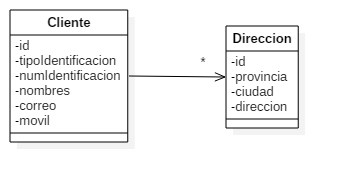
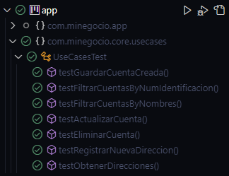

# Spring Boot MiNegocio App

## Requerimientos
- [x] Objetos enviados y retornados en formato JSON
- [x] Buenas prácticas (Clean Code, SOLID)
- [x] Validación de Entrada de Datos
- [x] TDD
- [x] Java 8+
- [x] SpringBoot
- [x] PostgreSQL
- [x] Clean Architecture
- [x] JUnit y Mockito

## Funcionalidades
- [x] Funcionalidad para buscar y obtener un listado de Clientes con una Dirección
- [x] Funcionalidad para crear un nuevo Cliente con la Dirección matriz
- [x] Funcionalidad para editar los datos del Cliente
- [x] Funcionalidad para eliminar un Cliente
- [x] Funcionalidad para registrar una nueva Dirección por Cliente
- [x] Funcionalidad para listar las direcciones adicionales del Cliente

## Dependencias
- spring-boot-starter-parent 3.0.3
- Java 19
- spring-boot-starter-actuator
- spring-boot-starter-web
- spring-boot-starter-data-jpa
- postgresql
- spring-boot-starter-test
- spring-boot-maven-plugin

## Descripción
El sistema Mi negocio permite registrar de manera rápida una factura a consumidor final o cualquier otro cliente registrando los datos al momento de la facturación. Pero se necesita mejorar este proceso y es necesario tener una base de clientes por cada empresa que utiliza el sistema, de tal manera que al momento de facturar se pueda buscar un cliente por número de identificación o nombre.

## Resultado

### Crear

 

 

### Actualizar

### Agregar Dirección

### Buscar

 

 

### Listar Direcciones

### Eliminar

### Testing

 
 

## Versionamiento

(Tiber) **Febrero 2023 v1.1**
* Testing

(Tiber) **Febrero 2023 v1.0**

* Funcionalidades implementadas